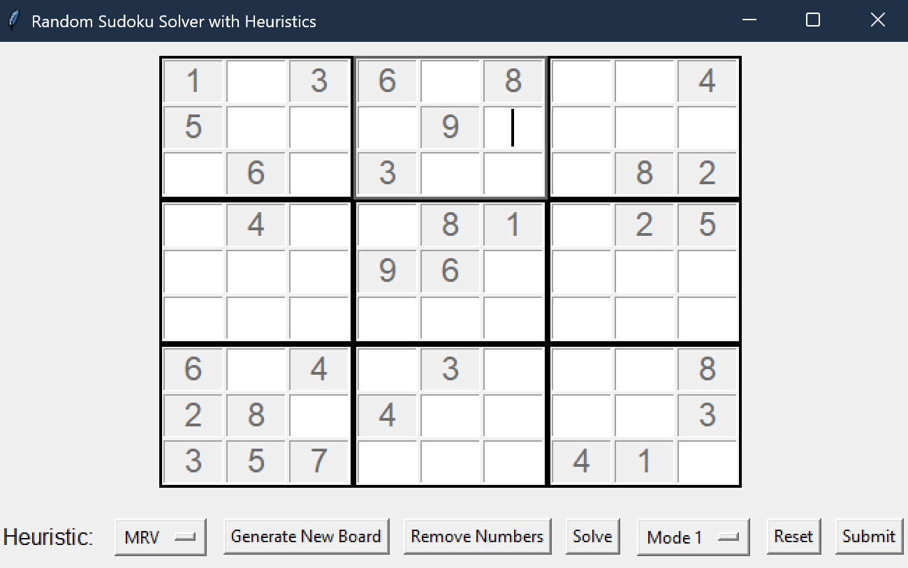

# 🧠 Sudoku Solver with GUI

A Python-based Sudoku solver and game built with **Tkinter**, featuring AI algorithms like **Backtracking**, **AC-3**, and heuristic enhancements. You can:
- Watch the AI solve puzzles
- Input your own puzzle
- Play random puzzles interactively

---

## 🎮 Features

- 🧩 **Mode 1:** Watch the AI solve a built-in puzzle step-by-step
- 🧠 **Mode 2:** Input your own puzzle and let the AI solve it
- 🎲 **Interactive Mode:** Play a randomly generated puzzle yourself
- ✅ Puzzle validation and solvability checks
- 👁️ Visual solving animation and updates

---

## 🧠 Algorithms Implemented

| Algorithm                 | Purpose                                           |
|--------------------------|---------------------------------------------------|
| **Backtracking**         | Puzzle solving & generation                       |
| **AC-3 (Arc Consistency)**| Domain pruning before solving                    |
| **MRV (Minimum Remaining Values)** | Smart variable selection        |
| **LCV (Least Constraining Value)** | Value selection heuristic       |
| **Forward Checking**     | Real-time domain reduction                        |

---

## 🧱 Data Structures

- **Board:** 9x9 grid of integers (`0` = empty)
- **Domains:** Set of valid values per cell
- **Arcs:** Related cell pairs used in AC-3
- **Queue:** Arc processing order

---

## 🖥️ GUI (Tkinter)

- Click-to-edit grid cells
- Real-time visualization of solving
- Input validation
- Random solvable puzzle generation
- Adjustable difficulty

---


## 🚀 Getting Started

### ✅ Requirements

- Python 3.x
- Tkinter (comes built-in with Python)

### ▶️ Run the Program
```bash
python main.py
```


---

## 📂 Project Structure

```
SudokuGame/
├── main.py
├── Arc_Consistency.py
├── assets/
│   └── Sudokogameplay.png
├── README.md
└── .gitignore
```

---

## 📸 Gameplay Screenshot




---
